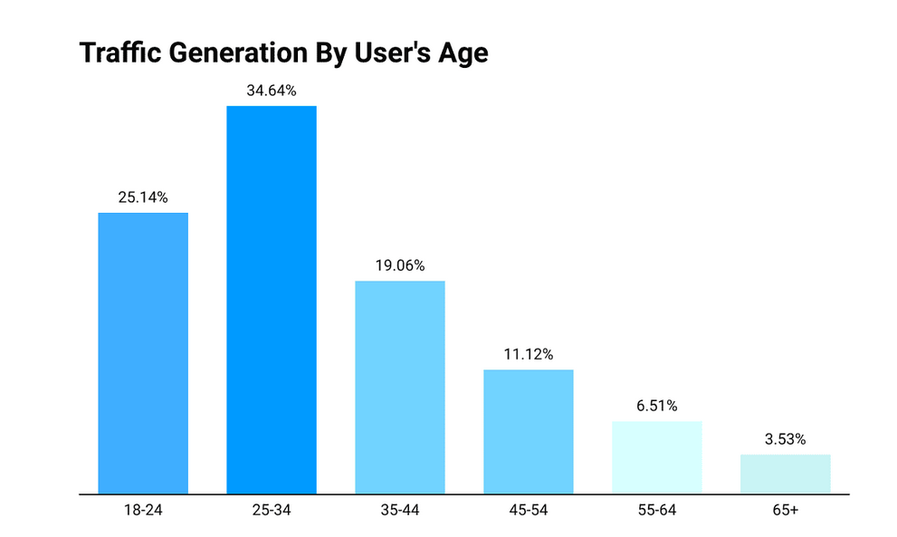
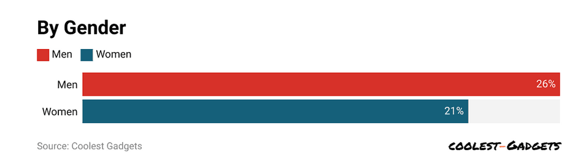

# Проектирование высоконагруженного сервиса Whatsapp
***

# Содержание
1. [Тема, MVP, целевая аудитория](#1-тема-mvp-анализ-трафика)
- [Список источников](#список-источников)

***

# 1. Тема, MVP, анализ трафика
***Whatsapp*** - мессенджер, где каждый может общаться с другими людьми как один на один, так и в группе - с помощью смс, голосовых сообщений, а также аудио- и видео звонков.

### MVP
1. Регистрация по номеру телефона
2. Отправка сообщений
3. Отправка вложений, в том числе голосовых сообщений
4. Просмотр истории чата
5. Поиска по чату
6. Групповые чаты
7. Аудио- и видео звонки

### Ключевые продуктовые решения
Сообщения хранятся только на клиенте. Время хранения на сервере - пока пользователь их не прочитает\

### Анализ трафика
- MAU - 3.3 млрд [[1]]
- DAU - >80% пользователей открывают ежедневно [[2]]
- Средняя продолжительности посещения в день - 33 минуты [[2]]
- Количество сообщений в день - 100 млрд [[2]]
- Количество голосовых сообщений в день - 7 млрд [[1]]
- Количество аудио- и видео звонков в день - 100 млн [[1]] 
- Количество сообщений, отправляемых в групповых чатах - 57% [[1]] 

#### Демографические показатели
 [[1]]

 [[1]]

#### Использование Whatsapp по странам
Топ - 10 стран по количеству пользователей [[3]]

| Страна    | Количество пользователей, млн |
|-----------|:-----------------------------:|
| Индия     |              535              |
| Бразилия  |              148              |
| Индонезия |              112              |
| США       |              98               |
| Филиппины |              88               |
| Мексика   |              77               |
| Россия    |              66               |
| Турция    |              56               |
| Египет    |              55               |
| Пакистан  |              52               |

#### Трафик через 5 ключевых стран [[1]]
| Страна    | Процент трафика | Всего устройств, млн | Мобильных устройств | Web/Пк |
|-----------|:---------------:|:--------------------:|:-------------------:|:------:|
| Индия     |      17.94      |         300          |       62.81%        | 37.19% |
| Бразилия  |      13.36      |         224          |       39.87%        | 60.13% |
| Индонезия |       5.6       |         93.9         |       73.43%        | 26.57% |
| США       |      4.96       |         83.2         |        29.59        | 70.41% |
| Мексика   |        4        |         67.7         |       44.07%        | 55.93% |

Мессенджер запрещён в 6 странах: [[1]]
- Китай
- ОАЭ
- Иран
- Сирия 
- Северная Корея
- Куба

***

[1]: https://www.coolest-gadgets.com/whatsapp-statistics/
[2]: https://learn.rasayel.io/en/blog/whatsapp-user-statistics/
[3]: https://aitechtonic.com/whatsapp-statistics/

- # Список источников
1. [Статистика и трафик Whatsapp][1]
2. [Пользовательская статистика][2]
3. [Количество пользователей Whatsapp][3]

