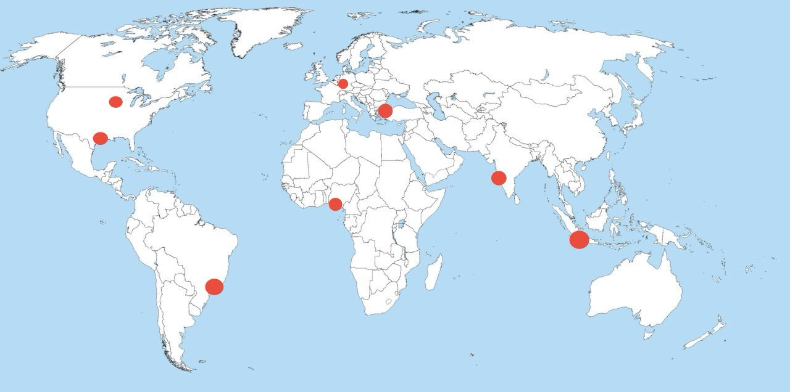
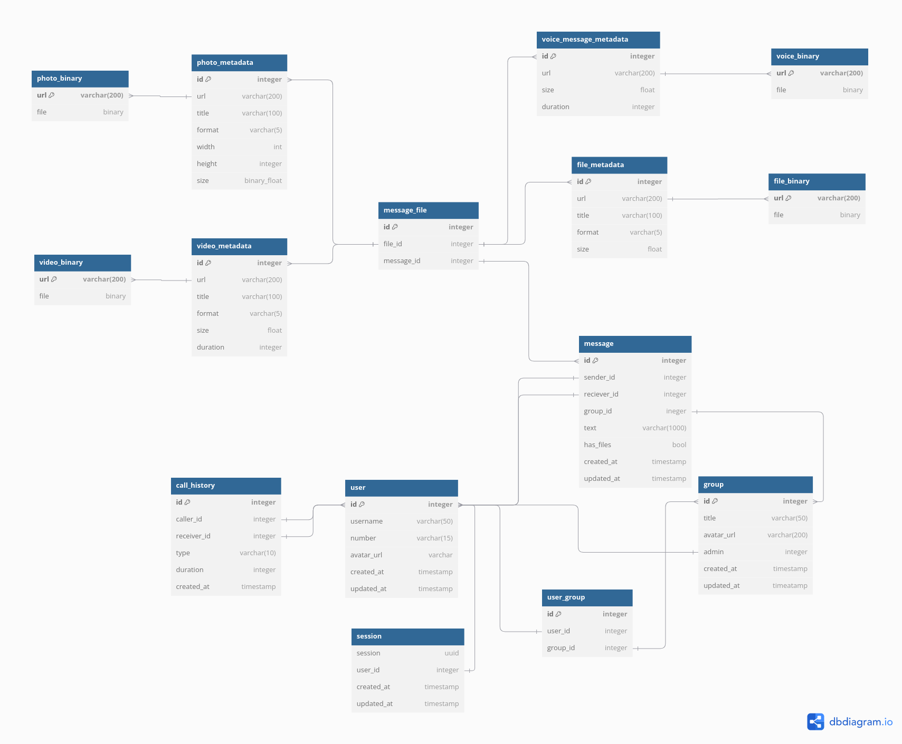
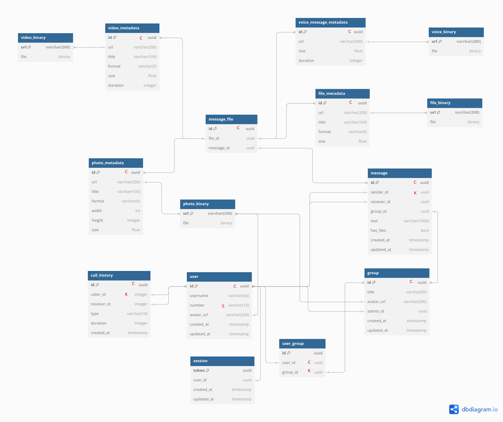
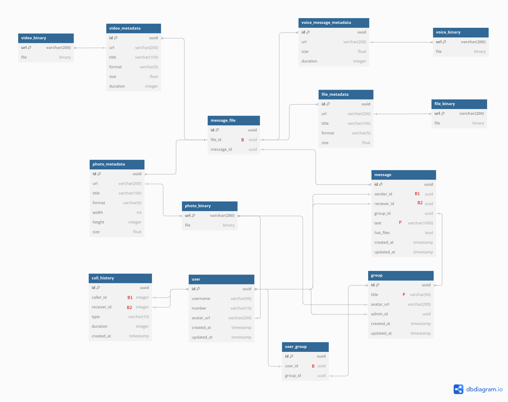

# Проектирование высоконагруженного сервиса Whatsapp
***

# Содержание
1. [Тема, MVP, целевая аудитория](#1-тема-mvp-анализ-трафика)
2. [Расчет нагрузки](#2-расчет-нагрузки)
3. [Глобальная балансировка](#3-глобальная-балансировка)
4. [Локальная балансировка](#4-локальная-балансировка)
5. [Логическая схема БД](#5-логическая-схема-бд)
6. [Физическая схема БД](#6-физическая-схема-бд)
7. [Алгоритмы](#7-алгоритмы)
- [Список источников](#список-источников)

***

# 1. Тема, MVP, анализ трафика
***Whatsapp*** - мессенджер, где каждый может общаться с другими людьми как один на один, так и в группе - с помощью текстовых и голосовых сообщений, а также аудио- и видео звонков.

### MVP
1. Регистрация и авторизация по номеру телефона
2. Отправка сообщений
3. Отправка вложений, в том числе голосовых сообщений
4. Просмотр истории чата
5. Поиск по чату
6. Групповые чаты
7. Аудио- и видео звонки

### Ключевые продуктовые решения
Сообщения хранятся только на клиенте. Сообщения хранятся на сервере до 30 дней в зашифрованном виде, если их не удалось
доставить сразу. В случае, если сообщение не доставлено за 30 дней, то оно удаляется с сервера.

### Анализ трафика
- MAU - 3.3 млрд [[1]]
- DAU - >80% пользователей открывают ежедневно [[2]]
- Средняя продолжительности посещения в день - 33 минуты [[2]]
- Количество сообщений в день - 100 млрд [[2]]
- Количество голосовых сообщений в день - 7 млрд [[1]]
- Количество аудио- и видео звонков в день - 100 млн [[1]] 
- Количество сообщений, отправляемых в групповых чатах - 57% [[1]]
- Количество пользователей в группе - от 10 до 50 человек, в зависимости от региона(в восточных странах группы обычно больших размеров)

#### Демографические показатели
 [[1]]

 [[1]]

#### Использование Whatsapp по странам
Топ - 10 стран по количеству пользователей [[3]]

| Страна    | Количество пользователей, млн |
|-----------|:-----------------------------:|
| Индия     |              535              |
| Бразилия  |              148              |
| Индонезия |              112              |
| США       |              98               |
| Филиппины |              88               |
| Мексика   |              77               |
| Россия    |              66               |
| Турция    |              56               |
| Египет    |              55               |
| Пакистан  |              52               |

#### Трафик через 5 ключевых стран [[1]]
| Страна    | Процент трафика | Всего устройств, млн | Мобильных устройств | Web/Пк |
|-----------|:---------------:|:--------------------:|:-------------------:|:------:|
| Индия     |      17.94      |         300          |       62.81%        | 37.19% |
| Бразилия  |      13.36      |         224          |       39.87%        | 60.13% |
| Индонезия |       5.6       |         93.9         |       73.43%        | 26.57% |
| США       |      4.96       |         83.2         |        29.59        | 70.41% |
| Мексика   |        4        |         67.7         |       44.07%        | 55.93% |

Мессенджер запрещён в 6 странах: [[1]]
- Китай
- ОАЭ
- Иран
- Сирия 
- Северная Корея
- Куба

***
# 2. Расчет нагрузки

- MAU - 3.3млрд
- DAU - 0.8 * 3.3млрд = 2.64млрд
### Расчёт RPS
Как было сказано выше количество сообщений, отправляемых в день - 100 млрд, таким образом:\
***RPS отправки текстовых сообщений*** = 100 млрд /(24ч * 60мин * 60сек) = 1'157'357 зап/сек

Количество голосовых сообщений также приведено выше - 7млрд, таким образом:\
***RPS отправки голосовых сообщений*** = 7млрд /(24ч * 60 мин * 60 сек) = 81'024 зап/сек

Компания Meta не раскрывает количество сообщений, которые содержат фото, видео или иные файлы в своих сообщениях.
Для оценки воспользуемся данными с сайта[[4]], там сказано, что медиафайлы составляют 60-70% трафика, но только 
25-35% от общего количество сообщений. Рассчитаем RPS с учетом того, что 35% - это медиа файлы, из них фото - 20%, 
видео - 10%, остальные типы файлов - 5%. Также учтем, что обычно при отправке медиафайлов происходит 2 запроса - 
первый POST-запрос загрузки файла на сервер, второй запрос - отправка метаданных.\
***RPS отправки сообщений с фото*** = 107млрд * 0.2 * 2 /(24ч * 60 мин * 60 сек) = 495'000 зап/сек\
***RPS отправки сообщений с видео*** = 107млрд * 0.1 * 2 /(24ч * 60 мин * 60 сек) = 248'000 зап/сек\
***RPS отправки сообщений с иными файлами*** = 107млрд * 0.05 * 2 /(24ч * 60 мин * 60 сек) = 124'000 зап/сек

Количество аудио и видеозвонков также было приведено выше и составляет - 100млн в день. 
Там учитывается и аудио и видео звонки, следовательно, для корректного расчета необходимо разделить их
в верном процентном соотношении. Обращаясь к источнику [[4]] можно найти информацию о том, что 
в среднем видео звонки составляют 30-35% от общего числа вызовов, в то время как голосовые - 65-70%.
Также учтем, что в среднем голосовые звонки длятся 10 минут [[5]], а видео звонки - 18 минут в день
Таким образом:\
***RPS голосовых звонков*** = 100 млн * 0.7 / (24ч * 60 мин * 60 сек) = 810 зап/сек\
***RPS видео звонков*** = 100 млн * 0.3 / (24ч * 60 мин * 60 сек) = 347 зап/сек\
В дальнейшем будем считать, что звонки происходят P2P и не будет учитывать в метриках.

Рассчитаем запросы на регистрацию. На основе отчета [[1]], видно, что за 2024 год
MAU увеличилось с 3млрд до 3,3 млрд. Также на основе различных отчетов можно сделать вывод о том, что примерно 12% пользователей
возвращаются в мессенджер за год. Таким образом, можно предположить, что количество новых пользователей приблизительно
300 млн * 0.82 = 246млн\
***RPS регистрации*** = 246 млн / (365 дней * 24ч * 60 мин * 60 сек) = 8 зап/сек

Рассчитаем запросы на поиск какого либо сообщения в чате. В среднем, активный пользователь использует функцию 
поиска 2 раза в день. DAU = 2.64 млрд.
***RPS поиска*** = 2.64 млрд * 2 / (24ч * 60 мин * 60 сек) = 61'111 зап/сек

Учтем, что анализ RPS для сообщений был приведен общий, но 57% из всех отправленных сообщений относятся к
групповым чатам. Таким образом, получаем\
***RPS отправки текстовых сообщений в групповом чате*** = 1.157.357 зап/сек * 0.57 = 659'693 зап/сек\
***RPS отправки голосовых сообщений в групповом чате*** = 81.024 зап/сек * 0.57 = 46'183 зап/сек\
***RPS отправки сообщений с фото в групповом чате*** = 495.000 зап/сек * 0.57 = 282'150 зап/сек\
***RPS отправки сообщений с видео в групповом чате*** = 248.000 зап/сек * 0.57 = 141'360 зап/сек\
***RPS отправки сообщений с иными файлами в групповом чате*** = 124.000 зап/сек * 0.57 = 70'680 зап/сек

Аналогично получаем RPS для переписок один на один\
***RPS отправки текстовых сообщений в личном чате*** = 1.157.357 зап/сек * 0.43 = 497'664 зап/сек\
***RPS отправки голосовых сообщений в личном чате*** = 81.024 зап/сек * 0.43 = 34'841 зап/сек\
***RPS отправки сообщений с фото в личном чате*** = 495.000 зап/сек * 0.43 = 212'850 зап/сек\
***RPS отправки сообщений с видео в личном чате*** = 248.000 зап/сек * 0.43 = 106'640 зап/сек\
***RPS отправки сообщений с иными файлами в личном чате*** = 124.000 зап/сек * 0.43 = 53'320 зап/сек

Рассчитаем RPS на чтение новых сообщений. Будем оперировать числами полученными выше, так как сообщений отправленных
всегда больше чем полученных. Кроме того, учтем, что в групповых чатах читают сообщений сразу несколько людей. 
Согласно отчету [[10]] в личных чатах дольше суток остаются непрочитанными примерно 20% сообщений, остальные сообщения
прочитываются в течение часа. В групповых же чатах примерно 50% сообщений остаются непрочитанными хотя бы одним пользователем
в то время как остальные 50% читаются в течение часа. Будем считать, что оставшиеся 50% читает только половина пользователей чата. 
Тогда имеем следующие RPS на чтение в личном чате:\
***RPS чтения текстовых сообщений в личном чате*** = 497'664 зап/сек * 0.8 = 398'131 зап/сек\
***RPS чтения голосовых сообщений в личном чате*** = 34'841 зап/сек * 0.8 = 27'872 зап/сек\
***RPS чтения сообщений с фото в личном чате*** = 212'850 зап/сек * 0.8 = 170'280 зап/сек\
***RPS чтения сообщений с видео в личном чате*** = 106'540 зап/сек * 0.8 = 85'312 зап/сек\
***RPS чтения сообщений с иными файлами в личном чате*** =53'320 зап/сек * 0.8 = 42'656 зап/сек

На чтение в групповом чате имеем:\
***RPS чтения текстовых сообщений в групповом чате*** = 659'693 * 0.5 * 30 + 659'693 * 0.5 * 15 = 14'843'092зап/сек\
***RPS чтения голосовых сообщений в групповом чате*** = 46'183 * 0.5 * 30 + 46'183 * 0.5 * 15 = 1'039'117зап/сек\
***RPS чтения сообщений с фото в групповом чате*** = 282'150 * 0.5 * 30 + 282'150 * 0.5 * 15 = 6'348'375зап/сек\
***RPS чтения сообщений с видео в групповом чате*** = 141'360 * 0.5 * 30 + 141'360 * 0.5 * 15 = 3'180'600 зап/сек\
***RPS чтения сообщений с иными файлами в групповом чате*** = 70'680 * 0.5 * 30 + 70'680 * 0.5 * 15 = 1'590'300 зап/сек

Рассчитаем RPS на создание нового чата. Выше выяснили, что количество новых пользователей за 2024 год - 
246млн. Каждый пользователь участвует в 15-20 групповых чатах [[7]], а в среднем в одном чате состоит 30 пользователей. 
Таким образом:\
***Количество новых чатов за год*** = 20 * 246млн / 30 = 164млн\
***RPS создания новых чатов*** = 164млн / (365 дней * 24ч * 60 мин * 60 сек) = 5 зап/сек

Кроме того, нужно учесть что расчеты приведены для средних значений RPS, нужно понимать, что бывают часы пиковых нагрузок. 
Для таких случаев введем коэффициент запаса = 2

### Расчёт трафика
Большая часть сообщений, согласно исследованиям [8] не превышает 10 слов. Так как наиболее используемый и общий известный
язык английский, то проверим среднюю длину слова именно на это языке. Согласно исследованию [9] средняя длина слова 5 символов.
Стандартная кодировка UTF8 занимает максимум 4 байта информации, латиница занимает 1 байт, но учтем, что сервисом пользуются 
в различных регионах и возьмем средний размер в 2 байта, таким образом размер текстового сообщения:\
10 слов * 5 букв * 2 байта = 100 байт
Кроме того, нужно помнить, что в сообщении присутствуют метаданные, например ID отправителя, время, статус. Заложим для 
этого еще некоторое количество байт, пусть размер сообщения будет 512 байт = 0.5 Кбайт. 
***Трафик текстовых сообщений в личных чатах*** = 497'664 зап/сек * 0.5 Кбайт = 248'822 Кбайт/с * 8 / 1024 / 1024 = 1.8 ГБита/с\
***Трафик текстовых сообщений в групповых чатах*** = 659'693 зап/сек * 0.5 Кбайт = 329'846 Кбайт/с * 8 / 1024 / 1024 = 2.5 ГБита/с

Среднее время голосового сообщения примем равным 30 секунд, а битрейт различается в зависимости от длины сообщения и 
варьируется в пределах 16-32кбит/с, причем агрессивнее сжимаются сообщения до 10 секунд. На основании исследований можно привести
статистику, показанную в таблице ниже

| Длительность | Процент |
|:------------:|:-------:|
|     <10с     |   50    |
|    10-30с    |   30    |
|    30-60с    |   15    |
|     >60с     |    5    |

Тогда средний битрейт можно взять как среднее арифметическое = 24кбит/с, тогда трафик ГС:\
***Трафик голосовых сообщений в личном чате*** = 34'841 * 24 * 30 / 1024 / 1024 = 24 Гбита/с\
***Трафик голосовых сообщений в групповом чате*** = 46'183 * 24 * 30 / 1024 / 1024 = 32 Гбита/с

Рассчитаем средний размер трафика с файлами. Средний размер фотографий на современных смартфонах 4Мбайт.
Пусть в среднем отправляются видео длиной 1 минута, учтем также, что большинство пользователей whatsapp, как было представлено
на графике в первом пункте из бедных стран, видео на телефонах будут сниматься в качестве hd 30. Но 15% пользователей используют 
более развитые смартфоны и снимают видео в среднем с разрешением 4к 30, тогда средний размер видео в 4к 30: 200Мбайт, а в hd 30: 60Мбайт
остальные файлы пусть имеют средний размер 10Мбайт.
PDF-файлов - 10Мбайт, таким образом получаем:\
***Трафик сообщений с фото в личных чатах*** = 212'850 зап/сек * 4Мб * 8 / 1024 = 6'651 ГБита/с\
***Трафик сообщений с фото в групповых чатах*** = 282'150 зап/сек * 4Мб * 8 / 1024 = 8'817 ГБита/с\
***Трафик сообщений с видео в личных чатах*** = 106'640 зап/сек * (200 * 0.15 + 60 * 0.85) Мбайт * 8 / 1024 / 1024 = 66 ТБита/с\
***Трафик сообщений с видео в групповых чатах*** = 141'360 зап/сек * (200 * 0.15 + 60 * 0.85) Мбайт * 8 / 1024 / 1024 = 87 ТБита/с\
***Трафик сообщений с иными файлами в личных чатах*** = 53'320 зап/сек * 10 Мбайт * 8 / 1024 = 4'165 ГБита/с\
***Трафик сообщений с иными файлами в групповых чатах*** = 70'680 зап/сек * 10 Мбайт * 8 / 1024 = 5'521 ГБита/с

Теперь рассчитаем аналогичный трафик для чтения всех видов сообщений:\
***Трафик чтения текстовых сообщений в личных чатах*** = 398'131 зап/сек * 0.5 Кбайт = 248'822 Кбайт/с * 8 / 1024 / 1024 = 1.5 ГБита/с\
***Трафик чтения текстовых сообщений в групповых чатах*** = 14'843'092 зап/сек * 0.5 Кбайт = 329'846 Кбайт/с * 8 / 1024 / 1024 = 57 ГБита/с
***Трафик чтения голосовых сообщений в личном чате*** = 27'872 * 24 * 30 / 1024 / 1024 = 20 Гбита/с\
***Трафик чтения голосовых сообщений в групповом чате*** = 1'039'117 * 24 * 30 / 1024 / 1024 / 1024 = 713 Гбита/с
***Трафик чтения сообщений с фото в личных чатах*** = 170'280 зап/сек * 4Мб * 8 / 1024 / 1024 = 5'2 ТБита/с\
***Трафик чтения сообщений с фото в групповых чатах*** = 6'348'275 зап/сек * 4Мб * 8 / 1024 / 1024 = 194 ТБита/с\
***Трафик чтения сообщений с видео в личных чатах*** = 85'312 зап/сек * (200 * 0.15 + 60 * 0.85) Мбайт * 8 / 1024 / 1024 = 53 ТБита/с\
***Трафик чтения сообщений с видео в групповых чатах*** = 3'180'600 зап/сек * (200 * 0.15 + 60 * 0.85) Мбайт * 8 / 1024 / 1024 = 1'965 ТБита/с\
***Трафик чтения сообщений с иными файлами в личных чатах*** = 42'656 зап/сек * 10 Мбайт * 8 / 1024 = 3'332 ГБита/с\
***Трафик чтения сообщений с иными файлами в групповых чатах*** = 1'590'300 зап/сек * 10 Мбайт * 8 / 1024 / 1024 = 121 ТБита/с

Рассчитаем трафик поиска сообщений по чату. Обычно поиск выполняется по одному ключевому слову, средний размер слова рассчитывали выше
Таким образом:\
***Трафик поиска по чату*** = 61'111 зап/сек * (5 букв * 2 байта + 300 байт) * 8 бит / 1024 / 1024 / 1024 = 0.14 Гбит/с 

Рассчитаем трафик на создание групповых чатов. Максимальная длина названия чата в whatsapp 25 символом, каждый кодируется 
2 байтами + метаинформация, примерно 100 байт. Кроме того средний чат содержит 30 пользователей, следовательно, отправляется
информация об этих пользователях (ID), 30 * 4 = 120 байт. Таким образом:\
***Трафик создания групповых чатов*** = 5 * (120 + 100 + 2 * 25) байт * 8 бит / 1024 = 11Кбит/с.\
Этот трафик довольно мал по сравнению с остальными, следовательно, не будем его учитывать и аппроксимируем 0 в таблице

Рассчитаем трафик на регистрацию. Для регистрации необходимо имя, номер телефона и аватарка. Пусть аватарка весит 1Мб, тогда
весом имени и номера телефона можно учесть как метаданные. С учетом необходимости всех метаданных примем размер профиля
1.3Мб. Тогда:\
***Трафик регистрации*** = 1.3 * 8 * 8 / 1024 = 0.1Гбит/с

### Расчет хранилища
Необходимо хранить: новые сообщения, новые группы и новых пользователей. Также учтем, что сообщения хранятся на сервере 
лишь до того времени, пока пользователь их не прочтет. Остальное время они хранятся на клиенте. Кроме того сообщения хранятся 
один месяц. Согласно отчету [[10]] в личных чатах дольше суток остаются непрочитанными примерно 20% сообщений, остальные сообщения
прочитываются в течение часа. В групповых же чатах примерно 50% сообщений остаются непрочитанными хотя бы одним пользователем
в то время как остальные 50% читаются в течение часа. 

***Файловое хранилище постоянная основа ежедневно*** = ((24+6'651+66'000+4'165) * 0.2 + (32+8'817+87'000+5'521) * 0.5) * (24ч * 60 минут * 60 секунд) / 1024 / 1024 / 8 = 680 Пбайт\
***Файловое хранилище в течение часа*** = ((24+6'651+66'000+4'165) * 0.8 + (32+8'817+87'000+5'521) * 0.5) *(60 минут * 60 секунд) / 1024 / 1024 / 8 = 48Пбайт 

Таким образом необходимое хранилище, с учетом хранения в течение месяца:\
***Файловое хранилище*** = 680 * 30 + 48 = 20'448 Пбайт

Информацию о новых пользователях и группах храним постоянно, сообщения же хранятся так же один месяц, в случае их не прочтения
Таким образом основное хранилище:\
***Основное хранилище текст не читаемый*** = (1.8 * 0.2 + 2.5 * 0.5) * (24ч * 60 минут * 60 секунд) * 30 дней / 1024 / 1024 / 8 = 0.5Пбайт/
***Основное хранилище текст читаемый*** = (1.8 * 0.8 + 2.5 * 0.5) * (60 минут * 60 секунд) / 1024 / 1024 / 8 = 0.001Пбайт

***Основное хранилище пользователи и группы*** = (3.3 млрд * 1.3МБ + 0.11 млрд * 0.001МБ) / 1024 / 1024 / 1024= 4Пбайт

***Основное хранилище*** = 4Пб + 0.001Пб + 0.5Пб = 4.6 Пбайт.

Рассчитаем потенциальный рост хранилищ. Основное хранилище будет расти за счет увеличения текстовых сообщений + создание
новых пользователей и новых групп.\
***Основное хранилище пользователи и группы рост*** = (0.1 + 0.00001) * 365 дней * 24ч * 60 минут * 60 секунд / 1024 / 1024 / 8 = 0.4ПБайт в год

Исходя из приведенных выше данных получаем, что в среднем, каждый пользователь отправляет 30 сообщения в день. Таким образом
рост хранилища сообщений за год:\
***Основное хранилище сообщений рост*** = 8 * 365 дней * 24ч * 60 минут * 60 секунд * 30 * 512 байт / 1024 / 1024 / 1024 / 1024 / 1024 = 0.003Пбайт в год\

***Основное хранилище рост в год*** = 0.4+0.003 = 0.45 Пбайт/год

Аналогично исходя из приведенных выше данных получаем, что в среднем, каждый пользователь отправляет 2 голосовых сообщения в день\
***Рост хранилища из-за ГС*** = 8 * 365 дней * 24ч * 60 минут * 60 секунд * 2 * 24 * 30 / 8 / 1024 / 1024 / 1024 / 1024 = 0.4 Пбайт/год

Рассчитаем рост хранилища файлов из-за отправленных вложений, как было сказано раньше фото - 20%, видео - 10%, остальные типы файлов - 5%. 
Таким образом, имеем:\
***Рост хранилища из-за видео*** = 8 * 365 * 24 * 60 * 60 * 30 * 0.1 * 200Мбайт / 1024 / 1024 / 1024 = 141Пбайт в год\
***Рост хранилища из-за фото*** = 8 * 365 * 24 * 60 * 60 * 30 * 0.2 * 4Мбайт / 1024 / 1024 / 1024 = 5.7Пбайт в год\
***Рост хранилища из-за иных файлов*** = 8 * 365 * 24 * 60 * 60 * 30 * 0.05 * 10Мбайт / 1024 / 1024 / 1024 = 3.5Пбайт в год\

***Рост хранилища файлов в год*** = 141 + 5.7 + 3.5 + 0.04 = 150 Пбайт/год

Кроме того на все хранилище нужно ввести коэффициент запаса, так как в процессе расчета были округления и возможно всплески
прибытия новых пользователей, заложим под это дополнительно 15%.

## Результаты расчетов
|                       Метрика                       |    RPS     | RPS пиковое | Трафик, Гб/с | Трафик пиковое, Гб/с |
|:---------------------------------------------------:|:----------:|:-----------:|:------------:|:--------------------:|
|     Отправка текстовых сообщений в личном чате      |  497'664   |   995'328   |     1.8      |         3.6          |
|    Отправка текстовых сообщений в групповом чате    |  659'693   |  1'319'386  |     2.5      |          5           |
|     Отправка голосовых сообщений в личном чате      |   34'841   |   69'682    |      24      |          48          |
|    Отправка голосовых сообщений в групповом чате    |   46'183   |   92'366    |      32      |          64          |
|       Отправка сообщений с фото в личном чате       |  212'850   |   425'700   |    6'651     |        13'303        |
|     Отправка сообщений с фото в групповом чате      |  282'150   |   564'300   |    8'817     |        17'634        |
|      Отправка сообщений с видео в личном чате       |  106'640   |   213'280   |    66'000    |       132'000        |
|    Отправка  сообщений с видео в групповом чате     |  141'360   |   282'720   |    87'000    |       174'000        |
|  Отправка сообщений с иными файлами в личном чате   |   53'320   |   106'640   |    4'165     |        8'330         |
| Отправка сообщений с иными файлами в групповом чате |   70'680   |   141'360   |    5'521     |        11'042        |
|               Поиск сообщений по чату               |   61'111   |   122'222   |     0.14     |         0.28         |
|              Создание групповых чатов               |     5      |     10      |      0       |          0           |
|                     Регистрация                     |     8      |     16      |     0.1      |         0.2          |
|      Чтение текстовых сообщений в личном чате       |  398'131   |   796'262   |     1.5      |          3           |
|     Чтение текстовых сообщений в групповом чате     | 14'843'092 | 29'686'184  |      57      |         104          |
|      Чтение голосовых сообщений в личном чате       |   27'872   |   55'744    |      20      |          40          |
|     Чтение голосовых сообщений в групповом чате     | 1'039'117  |  2'078'235  |     713      |        1'426         |
|        Чтение сообщений с фото в личном чате        |  170'280   |   340'560   |    5'200     |        10'400        |
|      Чтение сообщений с фото в групповом чате       | 6'348'275  | 12'696'550  |   194'000    |       388'000        |
|       Чтение сообщений с видео в личном чате        |   85'312   |   170'624   |    53'000    |       106'000        |
|     Чтение  сообщений с видео в групповом чате      | 3'180'600  |  6'261'200  |  1'965'000   |      3'930'000       |
|   Чтение сообщений с иными файлами в личном чате    |   42'656   |   85'312    |    3'332     |        6'664         |
|  Чтение сообщений с иными файлами в групповом чате  | 1'590'300  |  3'180'600  |    121'00    |       242'000        |

|       Метрика хранилища        |   Значение    | Значение с коэффициентом запаса |
|:------------------------------:|:-------------:|:-------------------------------:|
|       Файловое хранилище       |  20'448Пбайт  |           23'500Пбайт           |
|       Основное хранилище       |   4,6Пбайт    |            5.3Пбайт             |
| Рост основного хранилища в год | 0.45Пбайт/год |          0.52Пбайт/год          |
| Рост файлового хранилища в год | 150Пбайт/год  |          172Пбайт/год           |

***
# 3. Глобальная балансировка

## Разбиение по доменам
- Основной домен - ms.whatsapp.com
- API - api.ms.whatsapp.com
- Статика - static.ms.whatsapp.com
- Медиа - media.ms.whatsapp.com
- Стриминг - stream.ms.whatsapp.com (голосовые звонки и видео звонки)

## Расположение датацентров

Основываясь на топ 10 странах по количеству пользователей, а также на карте расположения морских кабелей [[11]] было
принято решение расположить по два датацентра в Азии, Европе и Северной Америке, а также по одному датацентру в 
Африке и Южной Америке. 

**Азия**:
- Мумбаи(Индия) - страна с самым большим количеством пользователей, также опираясь на карту морских кабелей можно видеть
что именно в этот город заходит наибольшее количество кабелей. Также там находится реальный ЦОД meta.
- Джакарта(Индонезия) - третья страна по MAU, а также именно в этот город заходит наибольшее количество кабелей в индонезии, 
кроме того, этот датацентр улучшит покрытие Тихоокеанского региона и Австралии.

**Европа**
- Стамбул(Турция) - страна входящая в топ по количеству пользователей, также поможет обеспечить покрытием страны ближнего 
востока(Израиль, Саудовская Аравия), а также север Африки(Египет, Ливия, Судан)
- Франкфурт(Германия) - обеспечивает равномерное покрытие европейского континента и является ключевым хабом для европейского
интернета. Пинг до городов Европы приведен в таблице ниже

|         Страна          | Пинг, мс |
|:-----------------------:|:--------:|
|         Берлин          |   1-5    |          
|       Нидерланды        |   2-10   |         
|         Франция         |   5-15   |         
|         Италия          |  10-25   |
|         Испания         |  20-35   |          
|         Польша          |  10-20   |         
|         Швеция          |  20-30   |         
|     Россия(Москва)      |  30-50   |
| Россия(Санкт-Петербург) |  35-55   |

**Африка**
- Лагос(Нигерия) - страна находящаяся в географическом центре Африки, что обеспечивает равномерное покрытие по Африке,
а также, именно в этом городе находятся основные датацентры, так как это крупнейшая по населению и экономике страна Африки. 

**Южная Америка**
- Сан-Паула(Бразилия) - страна, на втором месте по количеству пользователей, именно в этом городе находятся основные датацентры 
Бразилии, кроме того страна обеспечит равномерное покрытие по Южной Америке. 

**Северная Америка**
- Темпл(США, штат Техас) - обеспечит покрытие южной части Америки, а также Мексики, а это две страны, входящие в топ стран
по количеству пользователей.
- Алтун(США, штат Айова) - находится реальный ЦОД компании meta, а также обеспечит равномерное покрытие северной и
центральной Америки.

## Используемые технологии

В таблице приведу, для каких доменов, какие методы регулировки будут использоваться:

|         Домен          |            Метод регулировки             |
|:----------------------:|:----------------------------------------:|
|    ms.whatsapp.com     |            Latency based DNS             |
|  api.ms.whatsapp.com   |            Latency based DNS             |
| static.ms.whatsapp.com |            Latency based DNS             |
| media.ms.whatsapp.com  |            Latency based DNS             |
| stream.ms.whatsapp.com | Anycast(для сигнальных и TURN-серверов)  |

1. Latency based DNS - так как метрика задержки в данном случае играет более важную роль, чем остальные возможные метрики
2. Anycast для сигнальных и TURN-серверов при стриминге(было описано в [алгоритмы](#7-алгоритмы)), что позволит снизить задержки
и, в случае падения ДЦ поможет мнгновенно переключить трафик на ближайший, благодаря чему звонки не сильно просядут.

## Перенаправление запросов в случае отказа

В случае отказа датацентра будем перенаправлять трафик с него. 

1. Темпл(США, штат Техас) -> Резерв: Сан-Паула(Бразилия) -> 2 Резерв: Алтун(США, штат Айова)
2. Алтун(США, штат Айова) -> Резерв: Темпл(США, штат Техас) -> 2 Резерв: Сан-Паула(Бразилия)
3. Сан-Паула(Бразилия) -> Резерв: Темпл(США, штат Техас) -> 2 Резерв: Алтун(США, штат Айова)
4. Лагос(Нигерия) -> Резерв: Джакарта(Индонезия) -> 2 Резерв: Франкфурт(Германия)
5. Франкфурт(Германия) -> Резерв: Стамбул(Турция) -> 2 Резерв: Лагос(Нигерия)
6. Стамбул(Турция) -> Резерв: Франкфурт(Германия) -> 2 Резерв: Мумбаи(Индия)
7. Мумбаи(Индия) без резерва, так как 1/6 всех пользователей приходится на Индию, автоматическое перенаправление на 
другие ДЦ убьет также и резервные ДЦ.
8. Джакарта(Индонезия) -> Резерв: Мумбаи(Индия) (2 резерва нет, так как другие ДЦ находятся далеко и будет слишком 
9. большой пинг, кроме того, всего пользователи из Индии также уничтожат следующий ДЦ)

## Карта мира с расположением датацентров

***

# 4. Локальная балансировка
Для локальной балансировки будем использовать L7 уровень из-за более гибких настроек
(выделение функциональных групп бекендов, равномерное распределения нагрузки, обработка медленных клиентов).

Было принято решение использовать кластер прокси серверов, которые будут реализовывать логику балансировки на 
application server для улучшения отказоустойчивости, кэширование, для того, чтобы ускорить ответы для пользователей 
на какие-либо популярные или частые запросы, архивирование/сжатие контента для экономии трафика, что положительно скажется 
на скорости загрузки страницы, а также ssl-termination, чтобы HTTPS расшифровывался на прокси и передавался далее по HTTP, 
что позволит значительно снизить нагрузку на application server, так как операция расшифровки выполняется на прокси. Кроме
того кластер прокси-серверов имеет следующие преимущества:
- Снижение оверхеда - меньше соединение вида прокси-бекенд -> используем постоянные подключения в разогнанном состоянии (keep-alive)
- Упрощение масштабирования - простота в добавлении нового application-server
- Централизованное управление - SSL, кэш, балансировщик настраиваются в одном месте

Также при использовании данной конфигурации лучше работает кэширования ssl сессии, так как клиент попадает на нужный ip 
из-за уменьшения доступных айпишников из вне в целом -> избегаем оверхеда на ssl хендшейк. 

Для изоляции логики роутинга и балансировки межсервисного трафика будет использоваться API Gateway. 

### Отказоустойчивость
- Периодически производятся проверка работоспособности сервера с помощью health check 
- Резервный сервер, в случае отказа одного балансировщик перенаправляет трафик на другой.
***

# 5. Логическая схема БД

|        Таблица         |                                                                               Описание                                                                               |
|:----------------------:|:--------------------------------------------------------------------------------------------------------------------------------------------------------------------:|
|        message         | таблица для хранения сообщений, в случае, если сообщение отправлено в групповом чате, то receiver_id = 0, group_id = id группового чата. Если лично, то group_id = 0 |          
|          user          |                                           таблица для хранения пользователей, содержит, имя, номер, аватарку пользователя                                            |         
|         group          |                                    таблица для хранения групповых чатов, содержит название чата, аватар, айдишник создателя чата                                     |         
|      call_history      |                                таблица истории звонков, содержит продолжительность звонка, кто кому звонил, а также тип(видео/аудио)                                 |
|        session         |                                                               таблица для хранения сессий пользователя                                                               |          
|       user_group       |                                             таблица для связи many-to-many пользователей и групп, в которых они состоит                                              |         
|      message_file      |     таблица для связи файлов и сообщения, в котором есть файлы. Так как файлы различны и содержат разную метаинфромацию, требуется эта таблица для many-to-many      |         
|     video-metadata     |                                                         таблица, которая хранит метаинформацию о видео файле                                                         |
|     photo-metadata     |                                                         таблица, которая хранит метаинформацию о фото файле                                                          |
|     file-metadata      |                                                      таблица, которая хранит метаинформацию о файлах иного вида                                                      |
| voice-message-metadata |                                                     таблица, которая хранит метаинформацию о голосовом сообщении                                                     |
|      videо-binary      |                                                          таблица, которая хранит видео файл в бинарном виде                                                          |
|      photo-binary      |                                                          таблица, которая хранит фото файле в бинарном виде                                                          |
|      file-binary       |                                                       таблица, которая хранит файлы иного вида в бинарном виде                                                       |
|      voice-binary      |                                                     таблица, которая хранит голосовые сообщения в бинарном виде                                                      |

## Размеры данных и нагрузки на чтение/запись
Исходя из данных, представленных выше, можно предположить, что за месяц в хранилище набирается примерно:\
сообщений = (57*0.5+43*0.2)*30 = 1113млрд сообщений
Плюс к этому добавляется "буфер", из которого читаются сообщения, попавшие туда на час. Таких сообщений:\
(57*0.5+43*0.8) / 24 = 2.7Млрд.\
Итого сообщений: 1116 Млрд

Аналогично этому набираются сообщения с файлами всего их суммарно 35%, то есть за месяц набирается\
Итого файлов: 1116*0.35=390.6Млрд\
Из них:\
Фото: 1116*0.2 = 223.2Млрд\
Видео: 1116*0.1 = 111.6Млрд\
Иные: 1116*0.05 = 55.8Млрд\

|        Таблица         |                                                                   Размер данных, хранимых в таблице                                                                    |
|:----------------------:|:----------------------------------------------------------------------------------------------------------------------------------------------------------------------:|
|        message         | 16(id)+ 16(sender_id)+16(receiver_id)+16(group_id)+1(has_files)+ 8(created_at)+8(updated_at)+100*2(varchar) = 281 байта * 1116млрд /1024/1024/1024/1024 = **285ТБайт** |          
|          user          |             16(id)+50*2(username)+15*1(number)+ 200*2(avatar)+8(created_at)+8(updated_at) = 547 байт * 3.5млрд / 1024 / 1024 / 1024/ 1024 = **1.75ТБайт**              |         
|         group          |                            16(id)+50*2(title)+200*2(avatar)+16(admin_id)+8(created_at)+8(updated_at) = 548байт *  2.35млрд = **1.17ТБайт**                             |         
|      call_history      |                       16(id)+16(caller)+16(receiver)+10*1(type)+4(duration)+8(created_at) = 70Байт*100млн*365/1024/1024/1024/1024=**2.33Тбайт**                        |
|        session         |                16(token)+16(user_id)+8(created_at)+8(updated_at) = 48Байт*2.64Млрд(храним только у ежедневно активных)/1024/1024/1024 =    **118Гбайт**                |          
|       user_group       |                                                       48(3*id)Байт * 3.5Млрд*20  /1024/1024/1024/1024=**3Тбайт**                                                       |         
|      message_file      |                  48(3*id)Байт * 390.6Млрд*2(так как в одном сообщении с файлом в среднем отправляется 2 файла)/1024/1024/1024/1024  =  **34.1Тбайт**                   |         
|     video-metadata     |                         16(id)+200*2(url)+100*2(title)+5*1(format)+8(size)+4(duration)=  633Байт*111.6Млрд /1024/1024/1024/1024=**64.2Тбайт**                          |
|     photo-metadata     |                     16(id)+200*2(url)+100*2(title)+5*1(format)+8(size)+4(width)+4(height)=  637Байт*223.3Млрд /1024/1024/1024/1024=**129.3Тбайт**                      |
|     file-metadata      |                                16(id)+200*2(url)+100*2(title)+5*1(format)+8(size)=  629Байт*55.6Млрд /1024/1024/1024/1024=**31.8Тбайт**                                |
| voice-message-metadata |                                      16(id)+200*2(url)+8(size)+4(duration)=  428Байт*70млн*365 /1024/1024/1024/1024=**9.9Тбайт**                                       |
|      videо-binary      |                                           (200*2(url)+81*2^20(file)) * 111.6Млрд /1024/1024/1024/1024/1024 =   **8420Пбайт**                                           |
|      photo-binary      |                                                200*2(url)+4*2^20 * 223.3Млрд /1024/1024/1024/1024/1024 =   **832Пбайт**                                                |
|      file-binary       |                                                200*2(url)+10*2^20 * 55.6Млрд /1024/1024/1024/1024/1024 =   **518Пбайт**                                                |
|      voice-binary      |                                              (200*2(url)+90*2^10) * 70млн*365 /1024/1024/1024/1024/1024 =   **2.1Пбайт**                                               |

### Нагрузка на чтение/запись

Нагрузка на таблицы связанные с сообщениями взяты из ранее посчитанных значений. Также учтено, что ГС это примерно 5% сообщений.
Кроме того для таблицы photo_binary учтены рпс на создание и обращение от групп и пользователя. 

Нагрузка на таблицу session идет при каждой авторизации. В день авторизируется 2.64 Млрд пользователей, при каждом
заходе в приложение. В среднем, активный пользователь заходит в ватсапп 5 раз в день. Запись же 
происходит при создании нового пользователя, протухании сессии. Пусть сессия валидна в течение месяца. Тогда для всех MAU
нужно один раз обновить сессию + создать сессию на новых пользователей. 

Нагрузка на таблицу group происходит при каждом создании группы. Создание группы - 5rps. Но данная таблица подвергается 
изменению при добавлении или удалении пользователя. Будем считать, что один раз в неделю в каждой группе происходит какое-либо 
изменение. Тогда суммарный rps на запись: 3'640. Пусть примерно 10% из этих изменений аффектят аватарку группы(учтем для изменений).
Нагрузка на чтение приходится каждый раз когда пользователь открывает приложение, так как считываются данные о группах в
которых он состоит, кроме того, чтобы облегчить нагрузку, считывание происходит не сразу, а частями, при скролле. Тогда
каждый активный дневной пользователь заходит 5 раз в день и подгружает группы, пусть в одном скролле он загрузит только одну группу.
Также учтем, что все обращения к группе будут аффектить обращение к таблице photo_binary для подгрузки аватарки.

Таблица user_group изменяется каждый раз, когда изменятся или добавляются пользователи в группу. Таких изменений 90% от всех 
изменений группы. Обращений к этой таблице столько же, сколько и обращений на чтение к таблице group, так как при каждом
обращении к группе надо знать сколько в ней участников.

Таблица call_history изменяется только при добавлении нового звонка, следовательно, рпс равен рпс звонков. Нагрузка
на чтение происходит каждый раз, когда пользователь хочет просмотреть историю звонков. Исходя из статистики, это происходит
довольно редко, примерно один раз за неделю для каждого активного пользователя. 

Таблица user изменяется при создании нового пользователя, а также при изменении аватарки и имени пользователя. rps 
создания был 9, изменение аватарки в среднем происходит раз в месяц, в то время, как изменение имени пользователя раз в 
3 месяца, согласно различным оценкам. Исходя из этого складывается rps на запись. Нагрузка на чтение происходит каждый раз при 
открытии пользователем приложения, а также при чтении группы. Причем, при каждом таком обращении аффектится таблица 
photo_binary. Изначально при открытии приложения подгружается пускай 15 чатов, из них 1 группа, тогда остальные 14 - обращение
к таблице пользователей.

|        Таблица         | Нагрузка на чтение, rps | Нагрузка на запись, rps |
|:----------------------:|:-----------------------:|:-----------------------:|
|        message         |       15'000'000        |        1'157'407        |       
|          user          |        2'138'850        |          1'701          |     
|         group          |         152'775         |          3'640          |    
|      call_history      |          4'365          |          1'157          |
|        session         |         152'775         |          1'300          |         
|       user_group       |         152'775         |          3'276          |       
|      message_file      |        6'000'000        |         462'963         |      
|     video-metadata     |        1'500'000        |         115'740         |
|     photo-metadata     |        5'291'625        |         233'117         |
|     file-metadata      |         750'000         |         57'870          |
| voice-message-metadata |         750'000         |         57'870          |
|      videо-binary      |        1'500'000        |         115'740         |
|      photo-binary      |        5'291'625        |         233'117         |
|      file-binary       |         750'000         |         57'870          |
|      voice-binary      |         750'000         |         57'870          |

## Требования к консистентности

- **Внешние ключи**
- - поле id во всех таблицах является внешним ключом
- **Уникальность**
- - поле url в таблице *_binary является уникальным(UNIQUE CONSTRAINT)
- - все поля id - первичные ключи (Primary Key) являются типа uuid
- **Согласованность**
- - поля *_id должны быть такого же типа как и id в таблицах, на которые данное поле ссылается
- - поле duration выбрано типа integer и показывает продолжительность в секундах
- **Проверка значений**
- - поля size, width, height, duration - должны быть больше 0
- - поле call_history.type - один из двух вариантов (video, audio)
- **Обязательные поля**
- - id, url, created_at - обязательные поля (NOT NULL)
- - таблица message - не могут быть одновременно message = null и has_files = false
- - таблица user - number, username - обязательные(NOT NULL)

# 6. Физическая схема БД

## Сервер 

На бэкенде была выбрана база данных Cassandra, так как данная бд хорошо работает с большими нагрузками, кроме того имеет
высокую отказоустойчивость, так как данные сохраняются даже при выходе узлов из строя. Легкое горизонтальное масштабирование, 
так как новые узлы добавляются без простоев, а также имеет высокую скорость записи. Кроме того meta использует данную 
БД в нескольких своих проектах, например facebook, instagram. В целом в рамках Cassandra используется в большей степени
подход с малым количеством индексов и проектированием схемы исходя из запросов. В Cassandra нет внешних связей как в 
реалиционных базах, но укажу их на схеме для наглядности.
В Cassandra есть ключи шардирования или партиционирования (partition key обознач. K) и ключи кластеризации (clustering key обознач. C).
Вместе они образуют primary key (обознач. pk). Partition key отвечает за разбиение по шардам в кластере 
(записи с одним parition key будут храниться на одном наборе машин).
Clustering key (бывает двух видов, в зависимости от порядка. Везде используется по убыванию) отвечает за порядок строк, 
в котором лежат на одной машине записи из одной таблицы
Индексы в Cassandra также не совсем стандартные Storage-attached index (обознач. S) - он хранится 
совместно с данными, использует смещения для определения положения нужных данных

В качестве БД для сообщений и метаданных для файлов была выбрана Kafka, так как данный брокер способен выдеживать 
большую нагрузку, кроме того, она позволит не реализовывать удаление сущностей на сервере. 
Также было принято решение денормализовать таблицу message и разбить ее на две таблицы
- user2user_message
- group_message

Первая таблица отвечает за сообщения от пользователя к пользователю. Вторая отвечает за сообщения, отправленные в рамках
группы. В первой таблице ключ шардирования - sender, во второй - ключ шардирования group_id. Также установим автоматическое 
удаление данных, настроив retention.ms = 30 дней (30 * 24 * 60 * 60 * 1000 = 2592000000мс). В случае таблицы user2user_message
сообщение и все связанные с ним метаданные и файлы удаляются после прочтения(так как кафка доставила их до пользователя).
В случае группы - после того, как данное сообщение будет прочитано всеми пользователями группы. 

Кроме того выбор пал на данную базу данных, так как она подходит для временного хранения потоковых данных, что необходимо
именно в данном случае.

В качестве S3 хранилища был выбран Amazon S3 Express One Zone, так как он поддерживает высокие рпс(порядка миллионов), а также 
имеет приемлемую задержку(10мс). Кроме того, из-под капота поддерживает автоматическое масштабирование, что не мало важно.
Кроме того данное хранилище часто используется для мессенджеров.

Приведу таблицу, где распишу, какая БД используется для таблицы, а также PK и индекс, если необходимо

|        Таблица         |             БД             |           PK            |   Index   |
|:----------------------:|:--------------------------:|:-----------------------:|:---------:|
|   user2user_message    |           Kafka            |           id            |     -     |   
|     group_message      |           Kafka            |           id            |     -     |   
|          user          |         Cassandra          |          C(id)          | S(number) |
|         group          |         Cassandra          |          C(id)          |     -     |
|      call_history      |         Cassandra          |   K(caller_id), C(id)   |     -     |
|        session         |           Redis            |          token          |     -     |        
|       user_group       |         Cassandra          | K(group_id), C(user_id) |     -     |     
|      message_file      |           Kafka            |           id            |     -     |   
|     video-metadata     |           Kafka            |           id            |     -     |
|     photo-metadata     |           Kafka            |           id            |     -     |
|     file-metadata      |           Kafka            |           id            |     -     |
| voice-message-metadata |           Kafka            |           id            |     -     |
|      videо-binary      | Amazon S3 Express One Zone |           url           |     -     |
|      photo-binary      | Amazon S3 Express One Zone |           url           |     -     |
|      file-binary       | Amazon S3 Express One Zone |           url           |     -     |
|      voice-binary      | Amazon S3 Express One Zone |           url           |     -     |

## Клиент

На клиенте будет использоваться SQLite, так как эта БД часто используется именно на клиенте. Также тут ввожу два типа
индексов B - btree index и P - полнотекстовый.

Приведу таблицу, где распишу, какая Бд используется для таблицы, а также PK и индекс, если необходимо

|        Таблица         |   БД   | PK  |               Index                |
|:----------------------:|:------:|:---:|:----------------------------------:|
|        message         | SQLite | id  | B(sender_id, receiver_id), P(text) |   
|          user          | SQLite | id  |                 -                  |
|         group          | SQLite | id  |              P(title)              |
|      call_history      | SQLite | id  |     B(caller_id, receiver_id)      | 
|       user_group       | SQLite | id  |             B(user_id)             |     
|      message_file      | SQLite | id  |             B(file_id)             |   
|     video-metadata     | SQLite | id  |                 -                  |
|     photo-metadata     | SQLite | id  |                 -                  |
|     file-metadata      | SQLite | id  |                 -                  |
| voice-message-metadata | SQLite | id  |                 -                  |
|      videо-binary      | SQLite | url |                 -                  |
|      photo-binary      | SQLite | url |                 -                  |
|      file-binary       | SQLite | url |                 -                  |
|      voice-binary      | SQLite | url |                 -                  |

# 7. Алгоритмы.
- ***Алгоритм поиска по сообщениям на клиенте***

Создадим индекс FTS5 в SQLite для полнотекстового поиска, внутри он токенизирует по символам пробелов и пунктуации
согласно unicode61, также добавим туда trigram для поиска подстрок в строке.
Сама структура индекса основана на b-tree деревьях. В конечном итоге поиск будет осуществляться по совпадению, префиксу, 
а также подстроке в строке. FTS5 используется так как он более эффективно сжимает индексы, а также учитывает недостатки 
FTS3/4.

- ***Алгоритмы шифрования***

В WhatsApp используется Signal Protocol, который основан на асинхронном шифровании, X3DH ("Extended Triple Diffie-Hellman"),
Double Ratchet Algorithm. X3DH используется для подтверждения личностей отправителя и получателя между собой, и обмена 
временными ключами. На следующей стадии с помощью Double Ratchet Algorithm сообщение прогоняется через KDF цепочку 
(расшифрованное одно сообщение не позволяет расшифровать сообщение из прошлого) а с помощью параметра, который является 
входным для KDF алгоритма и уникальным для каждого сообщения реализуется защита от расшифровки будущих сообщений.

- ***Алгоритмы ГС***
- - **Алгоритм улучшения качества ГС**

Для шумоподавления будем использовать мл модель на основе архитектуры Dual-Signal Transformation LSTM Network(DTLN) 
подобные модели подходят для использования в real time, т.к. небольшие по размеру, имеют высокую скорость обработки
и достаточно хорошее качество. Кроме того, несмотря на то, что данная модель была выпущена в 2020 году она остается одной
из лучших моделей, приведу другие модели, которые рассматривались мной в сравнительной таблице:(MOS - оценка качества
речи от 1 до 5)

|     Метрика      |     DTLN     |    DPCRN    | TF-GridNet  |  DiffuSE   |
|:----------------:|:------------:|:-----------:|:-----------:|:----------:|
|  Качество(MOS)   |     4.1      |     4.3     |     4.6     |    4.7     |
|     Задержка     |     20мс     |    35мс     |    90мс     |   200мс    |
| Ресурсы(CPU/GPU) | CPU-friendly | требует GPU | Требует GPU | только GPU |

- - **Алгоритм голосовых звонков**

Для реализации звонков будем использовать WebRTC технологию, которая доступна в браузере, iOS, Android. 
Для обхода Nat окружения будем использовать ICE, который сочетает в себе STUN и TURN. Данный фреймворк позволяет автоматически
находить оптимальный путь для соединения между устройствами, даже если они находятся за разными типами NAT.
Механизм обхода NAT ICE состоит из 3 этапов:
1) Прямое соединение - если устройства в одной локальной сети
2) STUN-сервер - для получения внешнего IP/порта и проброса P2P
3) TURN-сервер - резервный релей, если P2P невозможен. 

Этапы работы для ГС:
1) Сбор кандидатов (Каждое устройство генерирует список возможных способов подключения, согласно трем этапам выше 
Локальный IP и порт устройства (например, 192.168.1.10:5000).
Внешний IP и порт, полученные через STUN-сервер (например, 95.123.45.67:55000).
IP и порт на TURN-сервере (например, relay.example.com:19303))

2) Обмен кандидатами через сигнальный сервер(в качестве стороннего канала выступает WebSocket)
3) Проверка связности - устройства пытаются установить соединение, тестируя кандидатов в порядке приоритета:
- HOST-HOST (если в одной сети)
- HOST-Server-Reflexive(прямой P2P по NAT)
- Server-Reflexive - Server-Reflexive (P2P через разные NAT)
- Relayed - Relayed (через TURN-сервер, если все остальное не работает)
4) Установка соединения - при нахождении первого рабочего пути ICE завершает перебор и медиа-данные начинают передаваться
по выбранному каналу.

[1]: https://www.coolest-gadgets.com/whatsapp-statistics/
[2]: https://learn.rasayel.io/en/blog/whatsapp-user-statistics/
[3]: https://aitechtonic.com/whatsapp-statistics/
[4]: https://www.cisco.com/c/en/us/solutions/collateral/executive-perspectives/annual-internet-report/white-paper-c11-741490.html
[5]: https://www.wharftt.com/how-long-can-a-whatsapp-call-last/
[6]: https://www.sandvine.com/hubfs/Sandvine_Redesign_2019/Downloads/2023/reports/Sandvine%20GIPR%202023.pdf
[7]: https://www.statista.com/topics/2018/whatsapp/ 
[8]: https://www.researchgate.net/publication/299487660_WhatsApp_Usage_Patterns_and_Prediction_Models
[9]: https://norvig.com/mayzner.html
[10]: https://www.pewresearch.org/internet/2021/08/19/mobile-technology-and-home-broadcast-2021/
[11]: https://submarine-cable-map-2023.telegeography.com/

# Список источников
1. [Статистика и трафик Whatsapp][1]
2. [Пользовательская статистика][2]
3. [Количество пользователей Whatsapp][3]
4. [Статистика интернет-трафика][4]
5. [Среднее время звонков][5]
6. [Среднее время видео звонков][6]
7. [Количество пользователей в чатах][7]
8. [Анализ длину сообщений][8]
9. [Анализ английских слов][9]
10. [Игнорирование сообщений в личных чатах][10]
11. [Карта морских кабелей][11]

